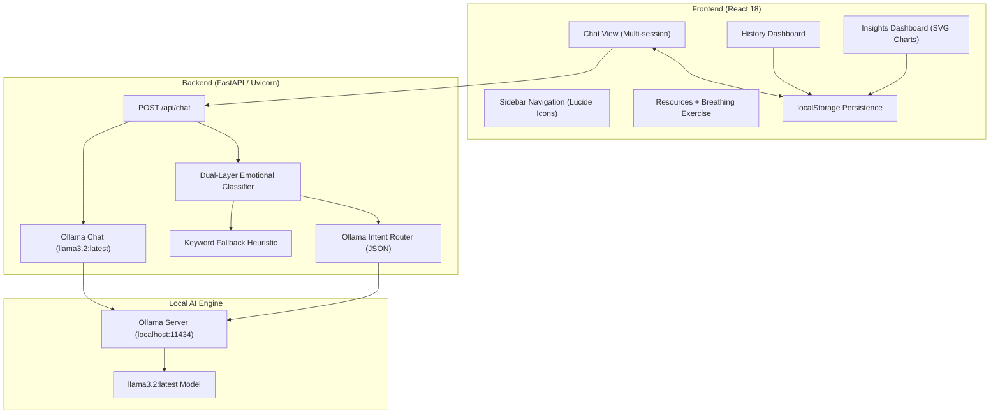

# Nereid — AI Companion & Mental Wellness Chat

A production-grade, AI-powered mental wellness companion designed for emotionally intelligent, real-time conversational support. Features compassionate multi-turn dialogue using local Ollama LLMs, real-time emotional sentiment classification with urgency triage, multi-session chat persistence with localStorage, interactive guided breathing exercises, mood analytics with custom SVG trend charts, a curated self-care resource library with crisis helplines, modern glassmorphism UI, and a fully responsive collapsible sidebar with Lucide icon navigation.

## Features

### Core Functionality
- **AI Conversational Support**: Multi-turn compassionate dialogue powered by `llama3.2:latest` via Ollama. Maintains full conversation history for contextually aware responses across the session.
- **Emotional Sentiment Triage**: Every user message is classified in real-time by a dual-layer classifier — Ollama-based zero-shot intent detection with a robust keyword-matching fallback — producing structured `emotional_state`, `urgency`, `intent`, and `topics` metadata.
- **Multi-Session Chat Management**: Create, switch, rename, and delete multiple independent conversation sessions. Session titles are auto-generated from the first user message.
- **LocalStorage Persistence**: All conversations and emotional analysis metadata are automatically serialized and persisted to the browser's `localStorage`, surviving page refreshes and tab closures.
- **Tab-Based Navigation**: Four fully functional sidebar tabs — Chat, History, Resources, Insights — each rendering a dedicated view component within the same layout shell.

### Advanced Features
- **Guided Box Breathing Bubble**: An interactive animated breathing exercise component on the Resources tab. A glassmorphic circle expands and contracts rhythmically through a 4-phase box breathing cycle (Inhale → Hold → Exhale → Hold Empty), driven by CSS keyframe transforms and a React interval timer.
- **Mood & Insights Analytics**: The Insights tab renders live emotional analysis derived from accumulated chat history — including a custom animated SVG Bézier line chart tracking distress trends over the last 10 messages, horizontal topic bar charts, mood distribution progress bars, and a personalized actionable wellbeing advice card.
- **Reflection History Dashboard**: The History tab displays a searchable grid of all past chat sessions as styled cards — including last message preview, auto-detected mood tag pills, and a one-click resume button that instantly switches the active chat session.
- **Crisis & Self-Help Resources**: The Resources tab provides a searchable library of evidence-based self-care exercises (5-4-3-2-1 grounding, sleep hygiene, journaling prompts), alongside prominently displayed emergency crisis hotlines (988 Lifeline, Crisis Text Line, international helpline locator).
- **Standalone Landing Page**: A fully separated, full-screen introductory home page (no sidebar) featuring a modern hero illustration, deep product narrative ("About Nereid"), our "reflective listening" philosophy, a qualities grid, a 3-step quick start guide, and an overlay Call-to-Action banner leading seamlessly into the main app dashboard.
- **Keyword Sentiment Fallback**: A zero-dependency, latency-free local classifier handles emotional routing when the Ollama model is offline or slow — detecting crisis language, high distress, moderate anxiety, sadness, sleep issues, and professional help-seeking patterns via keyword heuristics.
- **Collapsible Sidebar**: Smooth `cubic-bezier` animated sidebar with icon-only collapsed mode. Includes a recent chats list with hover-reveal delete controls, active session highlighting, and full Lucide React icon integration.

---

## Tech Stack

### Backend
- **Python** with **FastAPI** and **Uvicorn** ASGI server.
- **Ollama Python SDK** for local LLM inference via the `llama3.2:latest` model.
- **Pydantic** for strict request/response schema validation.
- **CORS Middleware** configured for secure React frontend access on `localhost:3000`.
- **Dual-layer Emotional Classifier**: Ollama zero-shot JSON intent extraction with keyword-based fallback routing.

### Frontend
- **React 18** with functional components and hooks.
- **Axios** for API communication with the FastAPI backend.
- **Lucide React** for clean, consistent vector icon system.
- **Vanilla CSS** with custom CSS variables for the dark glassmorphism design system.
- **localStorage API** for client-side session and message persistence.
- **Custom SVG Charts**: Hand-crafted Bézier curve line charts and progress bar analytics — no external charting libraries.

---

## System Architecture



---

## Project Structure

```
nereid-therapist/
├── src/                            # React frontend source
│   ├── components/
│   │   ├── Home.js                 # Standalone landing page (hero, about, approach)
│   │   ├── Home.css
│   │   ├── Sidebar.js              # Collapsible nav with Lucide icons & recent chats
│   │   ├── Sidebar.css
│   │   ├── Chat.js                 # Multi-turn chat interface
│   │   ├── Chat.css
│   │   ├── MessageInput.js         # Auto-resizing textarea input
│   │   ├── MessageInput.css
│   │   ├── HistoryView.js          # Past sessions dashboard with search
│   │   ├── HistoryView.css
│   │   ├── Resources.js            # Guided breathing + crisis resources
│   │   ├── Resources.css
│   │   ├── Insights.js             # SVG mood charts + analytics
│   │   └── Insights.css
│   ├── App.js                      # Root state: multi-chat, tab routing, localStorage
│   ├── App.css
│   ├── index.js
│   └── index.css                   # Global design tokens & dark theme variables
│
├── public/
│   ├── index.html
│   └── hero-illustration.png       # Generated custom vector hero illustration
│
├── api_server.py                   # FastAPI backend + emotional classifier
├── ml.py                           # Terminal-mode Nereid CLI with dual-layer routing
├── requirements.txt
├── package.json
└── README.md
```

---

## Setup & Running

### Prerequisites

- **Node.js** v16+ and **npm**
- **Python** 3.8+
- **Ollama** installed and running — [Download Ollama](https://ollama.ai/)
- `llama3.2:latest` model pulled

### 1. Pull the AI Model

```bash
ollama pull llama3.2:latest
```

### 2. Install Python Dependencies

```bash
pip install -r requirements.txt
```

### 3. Install React Dependencies

```bash
npm install
```

### Running the Stack

Open three terminal sessions:

**Terminal 1 — Start Ollama:**
```bash
ollama serve
```

**Terminal 2 — Start FastAPI Backend:**
```bash
python api_server.py
```
API available at `http://localhost:8000`

**Terminal 3 — Start React Frontend:**
```bash
npm start
```
App available at `http://localhost:3000`

---

## API Documentation

- **Chat Endpoint**:
  - `POST /api/chat` — Accepts user message + conversation history. Returns Nereid's reply and a structured `analysis` object containing `emotional_state`, `urgency`, `intent`, `topics`, and `needs_human` fields.
- **Health Endpoints**:
  - `GET /` — API status check.
  - `GET /health` — Health probe returning `{ "status": "healthy" }`.

### Chat Request Schema

```json
{
  "message": "I've been feeling really anxious about work",
  "conversation_history": [
    { "role": "user", "content": "..." },
    { "role": "assistant", "content": "..." }
  ]
}
```

### Chat Response Schema

```json
{
  "reply": "That sounds really difficult. Would you like to talk about what's been on your mind?",
  "success": true,
  "analysis": {
    "intent": "moderate_distress",
    "urgency": "moderate",
    "emotional_state": "anxious",
    "topics": ["anxiety", "work_stress"],
    "needs_human": "maybe",
    "notes": "Analyzed via Ollama classifier."
  }
}
```

---

## Configuration

### Change the AI Model

Edit `api_server.py`:

```python
MODEL = "llama3.2:latest"  # Replace with any Ollama-supported model
```

### Change Ports

- **Backend**: Edit `uvicorn.run(app, host="0.0.0.0", port=8000)` in `api_server.py`.
- **Frontend**: Set `PORT=3001` in a `.env` file at the project root.

---

## Troubleshooting

| Symptom | Fix |
|---|---|
| `Could not reach the server` | Ensure `python api_server.py` is running on port 8000 |
| `Error communicating with AI model` | Ensure `ollama serve` is running and the model is pulled |
| Model not found | Run `ollama list` and pull with `ollama pull llama3.2:latest` |
| CORS errors in browser | Verify `allow_origins` in `api_server.py` includes `http://localhost:3000` |

---

## License

This project is open source and available for personal and educational use.
