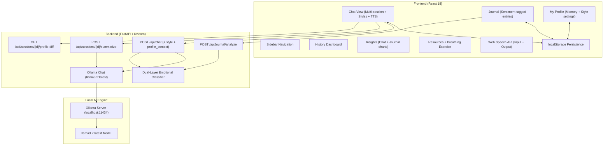

# Nereid — AI Companion & Mental Wellness Chat

A production-grade, AI-powered mental wellness companion designed for emotionally intelligent, real-time conversational support. Features compassionate multi-turn dialogue using local Ollama LLMs, real-time emotional sentiment classification with urgency triage, multi-session chat persistence, a personal safety plan builder, a private journaling mode, cross-session memory profiling, voice input/output, selectable conversation styles, mood analytics, and a curated self-care resource library — all running 100% locally with no cloud dependencies.

## Features

### Core Functionality
- **AI Conversational Support**: Multi-turn compassionate dialogue powered by `llama3.2:latest` via Ollama. Maintains full conversation history for contextually aware responses.
- **Emotional Sentiment Triage**: Every user message is classified in real-time by a dual-layer classifier — Ollama-based zero-shot intent detection with a keyword-matching fallback — producing structured `emotional_state`, `urgency`, `intent`, and `topics` metadata.
- **Multi-Session Chat Management**: Create, switch, rename, and delete multiple independent conversation sessions. Session titles are auto-generated from the first user message.
- **LocalStorage Persistence**: All conversations, journal entries, safety plan data, and memory profiles are automatically persisted to the browser's `localStorage`, surviving page refreshes and tab closures.
- **Tab-Based Navigation**: Seven sidebar tabs — Chat, Journal, History, Safety Plan, Resources, Insights, My Profile — each rendering a dedicated view within the same layout shell.

---

### Conversational Depth

#### Selectable Conversation Styles
Three distinct listening modes, selectable per-conversation via pill buttons in the chat footer:
- **🌱 Reflective Listening** *(default)* — mirrors and validates feelings; avoids giving solutions unless asked.
- **🔍 CBT Reframing** — gently explores cognitive distortions and offers balanced reframes.
- **💨 Venting / No Advice** — a quiet, supportive presence that strictly avoids suggestions.

Preferred style persists to `localStorage` and can also be set as a default from the **My Profile** tab. The selected style is injected directly into the LLM system prompt on the backend.

#### Cross-Session Memory Profile
Nereid builds a private, editable memory profile from your conversations:
- **Recurring Stressors** — patterns noticed across sessions that may be weighing on you.
- **Coping Strategies That Helped** — approaches mentioned in conversation that seemed to resonate.
- **Approaches That Didn't Help** — noted so Nereid avoids suggesting these again.
- **Ongoing Context** — broader life situations worth remembering across sessions.

The profile is injected as a compact context block into every LLM system prompt, giving Nereid continuity without re-reading entire chat logs. When a session ends (`beforeunload`), a `sendBeacon` fires a background summarization request; the backend LLM extracts new insights as a structured JSON diff and the client polls to silently merge updates on next load.

#### My Profile Page
A dedicated **My Profile** tab lets you:
- View, add, and delete individual memory items per category.
- Set your default listening style.
- See first-noted date and mention-count reinforcement badges on each item.
- Clear your entire memory profile with a confirmation dialog.
- First-time **privacy banner** explains all data stays on-device.

#### Journaling Mode
A distraction-free **Journal** tab for private text entries:
- Rich prompt rotation system with curated therapeutic writing prompts.
- Entries are sentiment-tagged on save via `POST /api/journal/analyze` (reuses existing classifier).
- High-urgency entries surface an inline **Crisis Resource Card** identical to the chat flow.
- All entries stored locally under `nereid_journal`; fully searchable list view.
- **Insights integration** — journal distress scores appear alongside chat data in the Insights trend chart with distinct visual markers, and a filter lets you toggle between Chat / Journal / All data.

#### Voice Input
- A **microphone button** in the message input area activates the browser's native `SpeechRecognition` API.
- Transcribed text populates the input field for user review before sending — **never auto-sends** (safety-first design for sensitive mental health contexts).
- Animated pulse ring while recording; graceful no-op if the browser doesn't support the API.

#### Voice Output (Text-to-Speech)
- A **🔇/🔊 toggle** in the chat footer enables read-aloud for Nereid replies using `speechSynthesis`.
- A **⚙️ settings popover** provides:
  - On/Off toggle chip.
  - Speed slider (0.6× – 1.5×).
  - Voice picker (lists all available browser voices).
- Skips crisis cards; cancels speech on disable or component unmount.
- All TTS settings persisted to `localStorage` (`nereid_tts_*`).

---

### Safety & Crisis Handling
- **Inline Crisis-Escalation Card**: When urgency is `high` or `immediate`, a dedicated crisis card is injected into the chat — displaying 988 (Lifeline), Crisis Text Line (741741), and a "View My Safety Plan" button. A debounce guard prevents duplicate cards.
- **Personal Safety Plan Builder**: A full six-section interactive form following the standard clinical template — Warning Signs, Internal Coping Strategies, Positive Distractions & Environments, Trusted Contacts (with callable phone links), Safe Environment Steps, and Professional Support Contacts. All data stored 100% locally in `localStorage`.
- **Slide-Out Safety Plan Drawer**: Opens as a smooth animated overlay from the crisis card without navigating away. Shows a read-only snapshot of coping steps, contacts, and callable numbers.
- **Configurable Check-in Nudge**: After a high-urgency spike, a gentle nudge is scheduled client-side. If the user goes quiet for a configurable duration (default: 5 min), a soft check-in message appears with dismiss buttons ("I'm okay" / "Keep talking").
- **Escalation Event Logging**: Every crisis card trigger logs an `EscalationEvent` to `localStorage`, tracking session ID, urgency level, timestamp, and dismissed state — powering accurate nudge scheduling.

---

### Analytics & Resources
- **Mood & Insights Analytics**: The Insights tab renders live emotional analysis from accumulated chat and journal history — including an animated SVG Bézier line chart tracking distress trends, topic bar charts, mood distribution bars, and a wellbeing advice card. Filterable by Chat / Journal / All.
- **Guided Box Breathing Bubble**: An animated breathing exercise component on the Resources tab (Inhale → Hold → Exhale → Hold Empty) driven by CSS keyframe transforms.
- **Reflection History Dashboard**: Searchable grid of all past chat sessions with mood tag pills, last message preview, and one-click resume.
- **Crisis & Self-Help Resources**: Searchable library of evidence-based self-care exercises alongside crisis hotlines (988, Crisis Text Line, international locator).

---

## Tech Stack

### Backend
- **Python** with **FastAPI** and **Uvicorn** ASGI server.
- **Ollama Python SDK** for local LLM inference (`llama3.2:latest`).
- **Pydantic** for strict request/response schema validation.
- **CORS Middleware** for secure React frontend access on `localhost:3000`.
- **Dual-layer Emotional Classifier**: Ollama zero-shot JSON intent extraction with keyword-based fallback.
- **Background summarization**: `BackgroundTasks` runs post-session LLM profile extraction without blocking the UI.

### Frontend
- **React 18** with functional components and hooks.
- **Axios** for API communication.
- **Lucide React** for clean, consistent vector icons.
- **Vanilla CSS** with custom CSS variables for the dark glassmorphism design system.
- **localStorage API** for all client-side persistence (sessions, journal, safety plan, memory profile, TTS settings).
- **Web Speech API**: `SpeechRecognition` for voice input; `speechSynthesis` for voice output.
- **Custom SVG Charts**: Hand-crafted Bézier curve line charts and progress bar analytics — no external charting libraries.
- **Client-side Safety Engine**: Timer-based nudge scheduler, debounced escalation guard, foreground focus event listener.

---

## System Architecture



---

## Project Structure

```
nereid-therapist/
├── src/                            # React frontend source
│   ├── components/
│   │   ├── Home.js / .css          # Standalone landing page (hero, about, approach)
│   │   ├── Sidebar.js / .css       # Collapsible nav with Lucide icons & recent chats
│   │   ├── Chat.js / .css          # Multi-turn chat + styles + TTS + crisis cards + nudge
│   │   ├── MessageInput.js / .css  # Auto-resizing textarea + voice input mic button
│   │   ├── JournalView.js / .css   # Distraction-free journal editor + entry list
│   │   ├── ProfileView.js / .css   # Memory profile editor + default style selector
│   │   ├── CrisisResourceCard.js / .css  # Shared inline crisis card (Chat + Journal)
│   │   ├── SafetyPlanView.js / .css      # 6-section safety plan builder + nudge settings
│   │   ├── SafetyPlanDrawer.js / .css    # Slide-out read-only safety plan overlay
│   │   ├── HistoryView.js / .css   # Past sessions dashboard with search
│   │   ├── Resources.js / .css     # Guided breathing + crisis resources
│   │   └── Insights.js / .css      # SVG mood charts + analytics (Chat + Journal)
│   ├── utils/
│   │   ├── safetyStorage.js        # SafetyPlan, EscalationEvent, CheckInSettings helpers
│   │   ├── journalStorage.js       # CRUD helpers for journal entries (nereid_journal)
│   │   └── profileStorage.js       # UserProfile CRUD, buildProfileContext, mergeProfileDiff
│   ├── App.js                      # Root state: multi-chat, tab routing, foreground nudge checker
│   ├── App.css
│   ├── index.js
│   └── index.css                   # Global design tokens & dark theme variables
│
├── public/
│   ├── index.html
│   └── hero-illustration.png       # Generated custom vector hero illustration
│
├── api_server.py                   # FastAPI backend + emotional classifier + summarization
├── ml.py                           # Terminal-mode Nereid CLI with dual-layer routing
├── requirements.txt
├── package.json
└── README.md
```

---

## Setup & Running

### Prerequisites

- **Node.js** v16+ and **npm**
- **Python** 3.8+
- **Ollama** installed and running — [Download Ollama](https://ollama.ai/)
- `llama3.2:latest` model pulled

### 1. Pull the AI Model

```bash
ollama pull llama3.2:latest
```

### 2. Install Python Dependencies

```bash
pip install -r requirements.txt
```

### 3. Install React Dependencies

```bash
npm install
```

### Running the Stack

Open three terminal sessions:

**Terminal 1 — Start Ollama:**
```bash
ollama serve
```

**Terminal 2 — Start FastAPI Backend:**
```bash
python api_server.py
```
API available at `http://localhost:8000`

**Terminal 3 — Start React Frontend:**
```bash
npm start
```
App available at `http://localhost:3000`

---

## API Reference

| Method | Endpoint | Description |
|--------|----------|-------------|
| `POST` | `/api/chat` | Send user message; returns Nereid reply + sentiment analysis |
| `POST` | `/api/journal/analyze` | Analyze a journal entry's sentiment and urgency |
| `GET`  | `/api/styles` | List available conversation styles |
| `POST` | `/api/sessions/{id}/summarize` | Trigger background session summarization (returns 202 immediately) |
| `GET`  | `/api/sessions/{id}/profile-diff` | Poll for ready profile diff from last summarization |
| `GET`  | `/health` | Health probe |

### Chat Request Schema

```json
{
  "message": "I've been feeling really anxious about work",
  "style": "reflective",
  "profile_context": "\n[Known context from past sessions]\n- Recurring stressors: work deadlines\n",
  "conversation_history": [
    { "role": "user", "content": "..." },
    { "role": "assistant", "content": "..." }
  ]
}
```

### Chat Response Schema

```json
{
  "reply": "That sounds really difficult. Would you like to talk about what's been on your mind?",
  "success": true,
  "analysis": {
    "intent": "moderate_distress",
    "urgency": "moderate",
    "emotional_state": "anxious",
    "topics": ["anxiety", "work_stress"],
    "needs_human": "maybe"
  }
}
```

### Profile Diff Schema (from summarization)

```json
{
  "new_stressors": ["work deadlines", "family conflict"],
  "new_coping_worked": ["short walks", "journaling"],
  "new_coping_didnt_work": ["forcing sleep"],
  "new_context": ["going through a difficult period at home"],
  "reinforced_existing_ids": [],
  "sessionId": "abc123"
}
```

---

## Configuration

### Change the AI Model

Edit `api_server.py`:

```python
MODEL = "llama3.2:latest"  # Replace with any Ollama-supported model
```

### Change Ports

- **Backend**: Edit `uvicorn.run(app, host="0.0.0.0", port=8000)` in `api_server.py`.
- **Frontend**: Set `PORT=3001` in a `.env` file at the project root.

---

## Troubleshooting

| Symptom | Fix |
|---|---|
| `Could not reach the server` | Ensure `python api_server.py` is running on port 8000 |
| `Error communicating with AI model` | Ensure `ollama serve` is running and the model is pulled |
| Model not found | Run `ollama list` and pull with `ollama pull llama3.2:latest` |
| CORS errors in browser | Verify `allow_origins` in `api_server.py` includes `http://localhost:3000` |
| Safety plan not saving | Check browser localStorage permissions; private/incognito mode may block writes |
| Crisis card not appearing | Confirm the backend is running and returning `analysis.urgency` in the response |
| Voice input not working | Requires HTTPS or `localhost`; check browser microphone permissions |
| TTS voices list is empty | Click the settings gear — voices load asynchronously; wait a moment after page load |
| Profile not updating after sessions | The summarization runs in the background; refresh after a few seconds |
| Check-in nudge not firing | Verify the Safety Plan settings have "Enable Check-in Nudge" toggled on |

---

## Safety & Privacy

Nereid is a **local-first** application — all data stays on your device:

- **Conversation history** is persisted in `localStorage` under `nereid_chats`.
- **Journal entries** are stored under `nereid_journal` — never transmitted.
- **Safety plan data** (including trusted contact names and phone numbers) is stored under `nereid_safety_plan` — it is never sent to any server.
- **Memory profile** (stressors, coping strategies, context) is stored under `nereid_user_profile`. The summarization endpoint receives conversation text to extract insights, but no personal data is retained server-side (the server holds diffs only in-memory until polled, then discards them).
- **Escalation events** are logged locally under `nereid_escalation_events` for nudge scheduling and are not used for model training or analytics.
- **No account, no cloud, no telemetry.** Clearing your browser's site data will erase all stored information.

> Nereid is a supportive tool, not a clinical service. In an emergency, please contact your local crisis line or emergency services.
